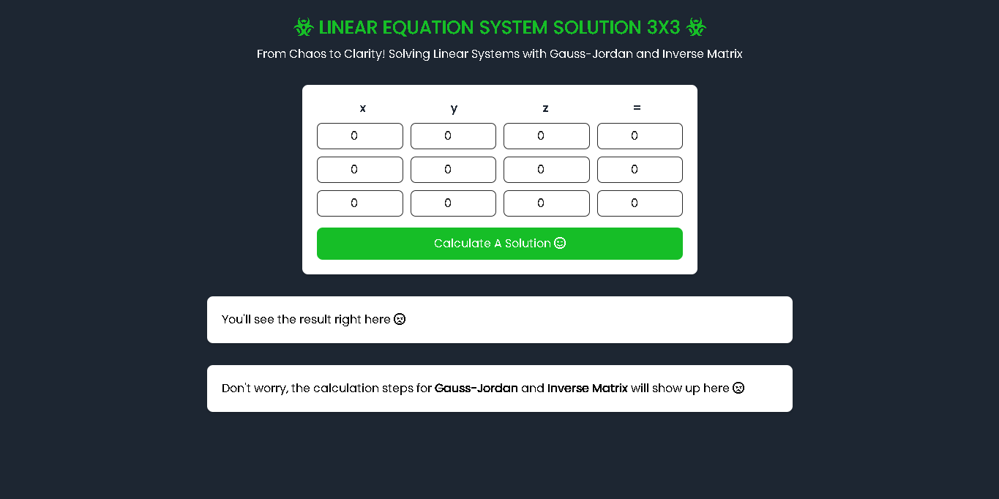

# 3x3 Linear Solver

Interactive web app to solve 3×3 systems of linear equations using **Gauss–Jordan Elimination** and **Inverse Matrix** methods. Built with Tailwind CSS and Math.js as a Numerical Methods course project.

---

## 🔗 Live Demo
https://3x3linearsolver.netlify.app/

---

## 🖼️ Preview

---

## 📊 Project Overview
Users can input a **3×4 augmented matrix** to solve a system of three linear equations. The app displays:

- Final solution for the system
- Step-by-step intermediate calculations using **Gauss–Jordan** and **Inverse Matrix** methods

All computations run client-side using JavaScript and Math.js, with a clean and responsive UI styled using Tailwind CSS.

---

## 🌟 Key Features
- Solve linear systems using Gauss–Jordan & Inverse Matrix methods
- Step-by-step calculation display for learning & verification
- Responsive, minimalist UI with Tailwind CSS
- Client-side calculations (no backend required)

---

## 🧰 Tech Stack
- HTML5
- Tailwind CSS v3.4.1
- JavaScript (Vanilla)
- Math.js

---

## 👤 Author
Alip Saefulloh